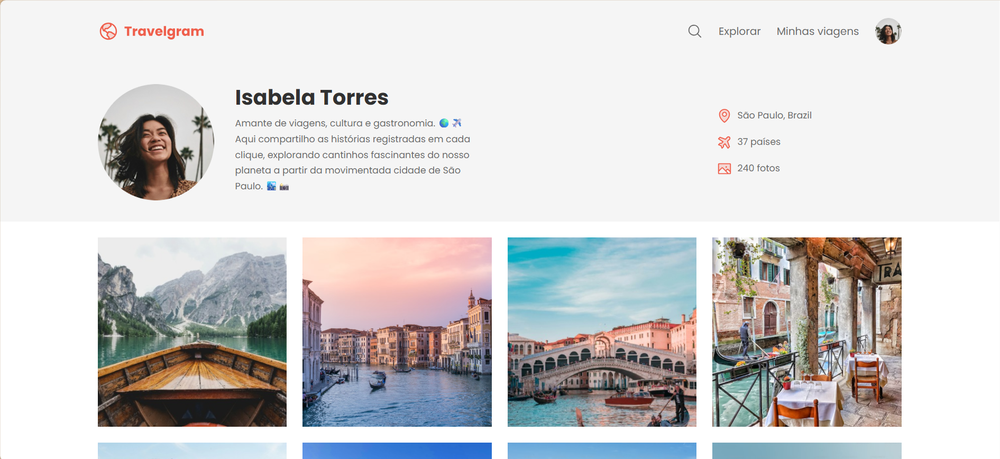

# 🌍 Travelgram

Landing Page desenvolvida para praticar HTML5 e CSS3, com foco na utilização do **Flexbox** para construção de layouts modernos e responsivos.

## 📸 Preview

---

## 🚀 Tecnologias Utilizadas

- HTML5
- CSS3
- Google Fonts

---

## 📚 Conceitos praticados

Durante o desenvolvimento deste projeto pratiquei:

- Flexbox
  - display: flex
  - flex-direction
  - justify-content
  - align-items
  - align-content
  - flex-wrap
  - gap
- Box Model
- Box Sizing
- Variáveis CSS
- Pseudo-classes
- Pseudo-elementos
- Combinators
- Estrutura Semântica
- Posicionamento de elementos

---

## ✨ Funcionalidades

- Perfil de viajante
- Informações pessoais
- Galeria de fotos
- Layout organizado com Flexbox
- Estrutura semântica em HTML5

---

## 🌐 Projeto Online

Acesse o projeto:
🔗 https://kauanemota.github.io/projeto-travelgram/

## 👩‍💻 Autora

Desenvolvido por **Kauane Mota**.
